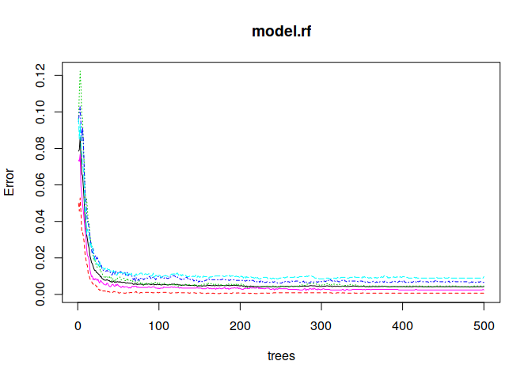
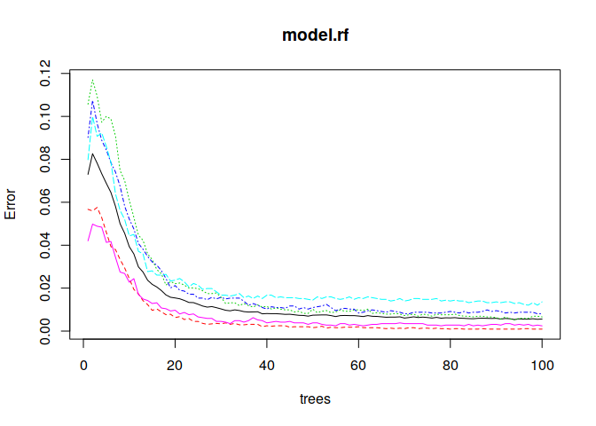
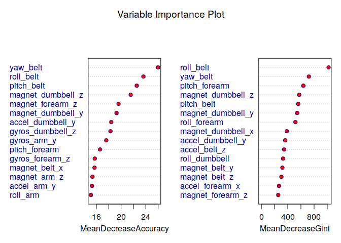

# Coursera: Practical Machine Learning Prediction Assignment
Ricardo Rezende  

**Introduction**

Using devices such as Jawbone Up, Nike FuelBand, and Fitbit it is now possible to collect a large amount of data about personal activity relatively inexpensively. These type of devices are part of the quantified self movement - a group of enthusiasts who take measurements about themselves regularly to improve their health, to find patterns in their behavior, or because they are tech geeks. One thing that people regularly do is quantify how much of a particular activity they do, but they rarely quantify how well they do it. In this project, your goal will be to use data from accelerometers on the belt, forearm, arm, and dumbell of 6 participants. They were asked to perform barbell lifts correctly and incorrectly in 5 different ways. More information is available from the website here: http://groupware.les.inf.puc-rio.br/har (see the section on the Weight Lifting Exercise Dataset).

**Objectives**

The goal of this project is to predict the manner in which they did the exercise especifically the "classe". The training data is:

**Dataset Preparation and Exploration**

Read the training and test data into dataframes.


```r
library(dplyr)
library(readr)
setwd("~/Cursos/Coursera/Data Science/assignments/Machine Learning/Course Project")
traindata <- read_csv('pml-training.csv')
dim(traindata)
testdata <- read_csv('pml-testing.csv')
dim(testdata)
```

Taking a closer look to the data, we decided to exclude from the predictors all variables that has a big number of NA's. The training data consist of 19622 observations and any columns with a number near this (> 18000 NA's) where excluded from the datasets. We ended up with 60 variables. Then we removed the records where there are any NA in the remaining values. In addition to that we removed the non-measures variables.


```r
traindata$X1 <- NULL
traindata$user_name <- NULL
traindata$raw_timestamp_part_1 <- NULL
traindata$raw_timestamp_part_2 <- NULL
traindata$cvtd_timestamp <- NULL
traindata$new_window <- NULL
traindata$num_window <- NULL
nacolumns <- which((sapply(traindata, function(x)sum(is.na(x)) > 18000)))
traindata <- na.omit(traindata[,-nacolumns])
traindata$classe <- as.factor(traindata$classe)

dim(traindata)
```

```
## [1] 19621    53
```

```r
testdata$X1 <- NULL
testdata$user_name <- NULL
testdata$raw_timestamp_part_1 <- NULL
testdata$raw_timestamp_part_2 <- NULL
testdata$cvtd_timestamp <- NULL
testdata$new_window <- NULL
testdata$num_window <- NULL
testdata <- na.omit(testdata[,-nacolumns])

dim(testdata)
```

```
## [1] 20 53
```

We are going to use all remaining variables (53) to build a Random Forest to predict the 'classe' variable.
Now we split the dataset into a 80% training and 20% testing dataset. 
As pointed by Breiman[^Breiman], there is no need for cross-validation or a separate test set to get an unbiased estimate of the test set error.

[^Breiman]: https://www.stat.berkeley.edu/~breiman/RandomForests/cc_home.htm#ooberr

```r
library(caret)
library(randomForest)
seed <- 1234
set.seed(seed)
inTrain <- createDataPartition(traindata$classe, p=0.8)
DTrain <- traindata[inTrain[[1]],]
DTest <- traindata[-inTrain[[1]],]
model.rf <- randomForest(classe ~ . , data = DTrain)
```

Let's take a look at the final model Error x Trees:


```r
plot(model.rf)
```

<!-- -->

We can verify that on about 100 trees our error rate doesn't change anymore, so we gonna retrain ou model constrainig to this number of trees and see how it performs.


```r
model.rf <- randomForest(classe ~ . , data = DTrain, importance = TRUE, ntree = 100)
plot(model.rf)
```

<!-- -->

Now lets see which variables are most important to the model (most 15).


```r
varImpPlot(model.rf, main = 'Variable Importance Plot', color = 'navyblue', bg = 'red', n.var = 15)
```

<!-- -->

Finnaly how the model behaves on the Test Set.


```r
predicted <- predict(model.rf, DTest)
confusionMatrix(data = predicted , reference = DTest$classe)
```

```
## Confusion Matrix and Statistics
## 
##           Reference
## Prediction    A    B    C    D    E
##          A 1115    1    0    0    0
##          B    0  757    4    0    0
##          C    0    1  680    2    0
##          D    0    0    0  641    0
##          E    0    0    0    0  721
## 
## Overall Statistics
##                                          
##                Accuracy : 0.998          
##                  95% CI : (0.996, 0.9991)
##     No Information Rate : 0.2843         
##     P-Value [Acc > NIR] : < 2.2e-16      
##                                          
##                   Kappa : 0.9974         
##  Mcnemar's Test P-Value : NA             
## 
## Statistics by Class:
## 
##                      Class: A Class: B Class: C Class: D Class: E
## Sensitivity            1.0000   0.9974   0.9942   0.9969   1.0000
## Specificity            0.9996   0.9987   0.9991   1.0000   1.0000
## Pos Pred Value         0.9991   0.9947   0.9956   1.0000   1.0000
## Neg Pred Value         1.0000   0.9994   0.9988   0.9994   1.0000
## Prevalence             0.2843   0.1935   0.1744   0.1639   0.1838
## Detection Rate         0.2843   0.1930   0.1734   0.1634   0.1838
## Detection Prevalence   0.2845   0.1940   0.1741   0.1634   0.1838
## Balanced Accuracy      0.9998   0.9981   0.9966   0.9984   1.0000
```

The accuracy on the test set is pretty high: 0.9972, so the expected Out of Sample error is about 0.0028.

Save training model object for later.


```r
save(model.rf, file="modelrf.RData")
```

**Prediction on the test data**

Load the training model.


```r
load(file="modelrf.RData", verbose=TRUE)
```

```
## Loading objects:
##   model.rf
```

Get predictions and evaluate.


```r
predicted <- predict(model.rf, testdata, type = 'class')
```

**Submission to Coursera**

Write submission files.


```r
pml_write_files = function(x){
  n = length(x)
  for(i in 1:n){
    filename = paste0("problem_id_",i,".txt")
    write.table(x[i],file=filename,quote=FALSE,row.names=FALSE,col.names=FALSE)
  }
}

pml_write_files(predicted)
```
